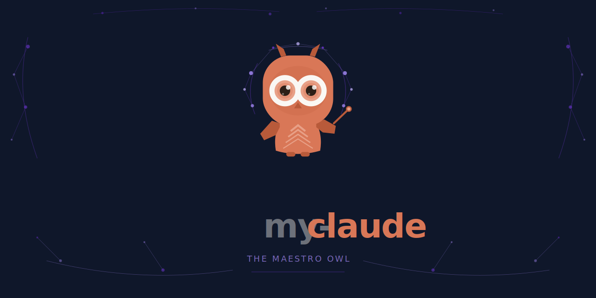

[English](../../README.md) | [한국어](./README.ko.md) | [日本語](./README.ja.md) | [中文](./README.zh.md) | [Deutsch](./README.de.md) | [Français](./README.fr.md)

> [](https://github.com/sehoon787/my-codex) Codex CLI를 찾으시나요? → **my-codex** — 네이티브 TOML 형식으로 제공하는 동일한 오케스트레이션

---

<div align="center">

# my-claude


**Claude Code를 위한 올인원 에이전트 하네스.**
**플러그인 하나로 200개 이상의 에이전트가 준비됩니다.**

Boss가 런타임에 모든 에이전트, 스킬, MCP 도구를 자동으로 탐색하고,<br>
작업을 적합한 전문가에게 라우팅합니다. 설정 파일도, 보일러플레이트도 없습니다.



</div>

---

## 설치

### 사람을 위한 설치

```bash
git clone --depth 1 https://github.com/sehoon787/my-claude.git /tmp/my-claude
bash /tmp/my-claude/install.sh
rm -rf /tmp/my-claude
```

또는 Claude Code 플러그인으로 먼저 설치한 후 동반 인스톨러를 실행하세요:

```bash
# Claude Code 세션 내에서:
/plugin marketplace add sehoon787/my-claude
/plugin install my-claude@my-claude

# 그런 다음 동반 도구 설치:
git clone --depth 1 https://github.com/sehoon787/my-claude.git /tmp/my-claude
bash /tmp/my-claude/install.sh
rm -rf /tmp/my-claude
```

### AI 에이전트를 위한 설치

```bash
curl -s https://raw.githubusercontent.com/sehoon787/my-claude/main/AI-INSTALL.md
```

전체 출력을 읽은 후, 각 단계를 순서대로 실행하세요. `WebFetch`가 아닌 `curl`을 사용하세요.

---

## Boss의 작동 방식

Boss는 my-claude의 핵심에 있는 메타 오케스트레이터입니다. 코드를 직접 작성하지 않고, 탐색하고 분류하고 매칭하고 위임하고 검증합니다.

```
사용자 요청
     │
     ▼
┌─────────────────────────────────────────────┐
│  Phase 0 · DISCOVERY                        │
│  Scan agents, skills, MCP, hooks at runtime │
│  → Build live capability registry           │
└──────────────────────┬──────────────────────┘
                       ▼
┌─────────────────────────────────────────────┐
│  Phase 1 · INTENT GATE                      │
│  Classify: trivial | build | refactor |     │
│  mid-sized | architecture | research | ...  │
│  → Counter-propose skill if better fit      │
└──────────────────────┬──────────────────────┘
                       ▼
┌─────────────────────────────────────────────┐
│  Phase 2 · CAPABILITY MATCHING              │
│  P0: gstack skill (if installed)            │
│  P1: Exact skill match                      │
│  P2: Specialist agent (200+)               │
│  P3: Multi-agent orchestration              │
│  P4: General-purpose fallback               │
└──────────────────────┬──────────────────────┘
                       ▼
┌─────────────────────────────────────────────┐
│  Phase 3 · DELEGATION                       │
│  6-section structured prompt to specialist  │
│  TASK / OUTCOME / TOOLS / DO / DON'T / CTX  │
└──────────────────────┬──────────────────────┘
                       ▼
┌─────────────────────────────────────────────┐
│  Phase 4 · VERIFICATION                     │
│  Read changed files independently           │
│  Run tests, lint, build                     │
│  Cross-reference with original intent       │
│  → Retry up to 3× on failure               │
└─────────────────────────────────────────────┘
```

### 우선순위 라우팅

Boss는 가장 적합한 매칭을 찾을 때까지 모든 요청을 우선순위 체인을 통해 순차적으로 처리합니다:

| 우선순위 | 매칭 유형 | 조건 | 예시 |
|:--------:|-----------|------|---------|
| **P1** | 스킬 매칭 | 작업이 독립적인 스킬에 해당 | `"merge PDFs"` → pdf 스킬 |
| **P2** | 전문가 에이전트 | 도메인별 에이전트 존재 | `"security audit"` → Security Engineer |
| **P3a** | Boss 직접 | 독립적인 에이전트 2~4개 | `"fix 3 bugs"` → 병렬 스폰 |
| **P3b** | 서브 오케스트레이터 | 복잡한 다단계 워크플로 | `"refactor + test"` → Sisyphus |
| **P3c** | 에이전트 팀 | P2P 통신이 필요한 경우 | `"implement + review"` → Review Chain |
| **P4** | 폴백 | 전문가 매칭 없음 | `"explain this"` → 범용 에이전트 |

### 모델 라우팅

| 복잡도 | 모델 | 사용 대상 |
|-----------|-------|----------|
| 심층 분석, 아키텍처 | Opus | Boss, Oracle, Sisyphus |
| 표준 구현 | Sonnet | executor, debugger, security-reviewer |
| 빠른 조회, 탐색 | Haiku | explore, 간단한 자문 |

### 3단계 스프린트 워크플로

엔드투엔드 기능 구현을 위해 Boss는 구조화된 스프린트를 오케스트레이션합니다:

```
Phase 1: DESIGN         Phase 2: EXECUTE        Phase 3: REVIEW
(interactive)            (autonomous)             (interactive)
─────────────────────   ─────────────────────   ─────────────────────
User decides scope      ralph runs execution    Compare vs design doc
Engineering review      Auto code review        Present comparison table
Confirm "design done"   Architect verification  User: approve / improve
```

---

## 아키텍처

```
┌─────────────────────────────────────────────────────┐
│                    User Request                       │
└───────────────────────┬─────────────────────────────┘
                        ▼
┌─────────────────────────────────────────────────────┐
│  Boss · Meta-Orchestrator (Opus)                      │
│  Discovery → Classification → Matching → Delegation  │
└──┬──────────┬──────────┬──────────┬─────────────────┘
   │          │          │          │
   ▼          ▼          ▼          ▼
┌──────┐ ┌────────┐ ┌────────┐ ┌────────┐
│ P3a  │ │  P3b   │ │  P3c   │ │  P1/P2 │
│Direct│ │Sub-orch│ │ Agent  │ │ Skill/ │
│2-4   │ │Sisyphus│ │ Teams  │ │ Agent  │
│agents│ │Atlas   │ │  P2P   │ │ Direct │
└──────┘ │Hephaes│ └────────┘ └────────┘
         └────────┘
┌─────────────────────────────────────────────────────┐
│  Behavioral Layer                                     │
│  Karpathy Guidelines · ECC Rules (87) · Hooks (7)    │
├─────────────────────────────────────────────────────┤
│  Specialist Agents (200+)                             │
│  OMO 9 · OMC 19 · Agency Eng. 26 · Superpowers 1    │
│  + 136 domain packs (on-demand)                       │
├─────────────────────────────────────────────────────┤
│  Skills (200+)                                        │
│  ECC 180+ · OMC 36 · gstack 40 · Superpowers 14     │
│  + Core 3 · Anthropic 14+                             │
├─────────────────────────────────────────────────────┤
│  MCP Layer                                            │
│  Context7 · Exa · grep.app                            │
└─────────────────────────────────────────────────────┘
```

---

## 구성 요소

| 카테고리 | 수량 | 출처 |
|----------|------:|--------|
| **핵심 에이전트** (항상 로드됨) | 56 | Boss 1 + OMO 9 + OMC 19 + Agency Engineering 26 + Superpowers 1 |
| **에이전트 팩** (온디맨드) | 136 | agency-agents의 12개 도메인 카테고리 |
| **스킬** | 200+ | ECC 180+ · OMC 36 · gstack 40 · Superpowers 14 · Core 3 |
| **Anthropic 스킬** | 14+ | PDF, DOCX, PPTX, XLSX, MCP builder |
| **규칙** | 87 | ECC common + 14개 언어 디렉터리 |
| **MCP 서버** | 3 | Context7, Exa, grep.app |
| **훅** | 7 | 위임 가드, 텔레메트리, 검증 |
| **CLI 도구** | 3 | omc, omo, ast-grep |

<details>
<summary><strong>핵심 에이전트 — Boss 메타 오케스트레이터 (1)</strong></summary>

| 에이전트 | 모델 | 역할 | 출처 |
|-------|-------|------|--------|
| Boss | Opus | 동적 런타임 탐색 → 역량 매칭 → 최적 라우팅. 코드를 직접 작성하지 않습니다. | my-claude |

</details>

<details>
<summary><strong>OMO 에이전트 — 서브 오케스트레이터 및 전문가 (9)</strong></summary>

| 에이전트 | 모델 | 역할 | 출처 |
|-------|-------|------|--------|
| Sisyphus | Opus | 의도 분류 → 전문가 위임 → 검증 | [oh-my-openagent](https://github.com/code-yeongyu/oh-my-openagent) |
| Hephaestus | Opus | 자율적 탐색 → 계획 → 실행 → 검증 | oh-my-openagent |
| Atlas | Opus | 작업 분해 + 4단계 QA 검증 | oh-my-openagent |
| Oracle | Opus | 전략적 기술 컨설팅 (읽기 전용) | oh-my-openagent |
| Metis | Opus | 의도 분석, 모호성 탐지 | oh-my-openagent |
| Momus | Opus | 계획 실현 가능성 검토 | oh-my-openagent |
| Prometheus | Opus | 인터뷰 기반 세부 계획 수립 | oh-my-openagent |
| Librarian | Sonnet | MCP를 통한 오픈소스 문서 검색 | oh-my-openagent |
| Multimodal-Looker | Sonnet | 이미지/스크린샷/다이어그램 분석 | oh-my-openagent |

</details>

<details>
<summary><strong>OMC 에이전트 — 전문가 작업자 (19)</strong></summary>

| 에이전트 | 역할 | 출처 |
|-------|------|--------|
| analyst | 계획 전 사전 분석 | [oh-my-claudecode](https://github.com/Yeachan-Heo/oh-my-claudecode) |
| architect | 시스템 설계 및 아키텍처 | oh-my-claudecode |
| code-reviewer | 집중적인 코드 리뷰 | oh-my-claudecode |
| code-simplifier | 코드 단순화 및 정리 | oh-my-claudecode |
| critic | 비판적 분석, 대안 제안 | oh-my-claudecode |
| debugger | 집중적인 디버깅 | oh-my-claudecode |
| designer | UI/UX 디자인 가이드 | oh-my-claudecode |
| document-specialist | 문서 작성 | oh-my-claudecode |
| executor | 작업 실행 | oh-my-claudecode |
| explore | 코드베이스 탐색 | oh-my-claudecode |
| git-master | Git 워크플로 관리 | oh-my-claudecode |
| planner | 신속한 계획 수립 | oh-my-claudecode |
| qa-tester | 품질 보증 테스팅 | oh-my-claudecode |
| scientist | 연구 및 실험 | oh-my-claudecode |
| security-reviewer | 보안 리뷰 | oh-my-claudecode |
| test-engineer | 테스트 작성 및 유지 관리 | oh-my-claudecode |
| tracer | 실행 추적 및 분석 | oh-my-claudecode |
| verifier | 최종 검증 | oh-my-claudecode |
| writer | 콘텐츠 및 문서 작성 | oh-my-claudecode |

</details>

<details>
<summary><strong>Agency Engineering — 항상 로드되는 전문가 (26)</strong></summary>

| 에이전트 | 역할 | 출처 |
|-------|------|--------|
| AI Engineer | AI/ML 엔지니어링 | [agency-agents](https://github.com/msitarzewski/agency-agents) |
| Backend Architect | 백엔드 아키텍처 | agency-agents |
| CMS Developer | CMS 개발 | agency-agents |
| Code Reviewer | 코드 리뷰 | agency-agents |
| Data Engineer | 데이터 엔지니어링 | agency-agents |
| Database Optimizer | 데이터베이스 최적화 | agency-agents |
| DevOps Automator | DevOps 자동화 | agency-agents |
| Embedded Firmware Engineer | 임베디드 펌웨어 | agency-agents |
| Frontend Developer | 프론트엔드 개발 | agency-agents |
| Git Workflow Master | Git 워크플로 | agency-agents |
| Incident Response Commander | 인시던트 대응 | agency-agents |
| Mobile App Builder | 모바일 앱 | agency-agents |
| Rapid Prototyper | 빠른 프로토타이핑 | agency-agents |
| Security Engineer | 보안 엔지니어링 | agency-agents |
| Senior Developer | 시니어 개발 | agency-agents |
| Software Architect | 소프트웨어 아키텍처 | agency-agents |
| SRE | 사이트 신뢰성 | agency-agents |
| Technical Writer | 기술 문서 | agency-agents |
| AI Data Remediation Engineer | 자가 복구 데이터 파이프라인 | agency-agents |
| Autonomous Optimization Architect | API 성능 거버넌스 | agency-agents |
| Email Intelligence Engineer | 이메일 데이터 추출 | agency-agents |
| Feishu Integration Developer | Feishu/Lark 플랫폼 | agency-agents |
| Filament Optimization Specialist | Filament PHP 최적화 | agency-agents |
| Solidity Smart Contract Engineer | EVM 스마트 컨트랙트 | agency-agents |
| Threat Detection Engineer | SIEM 및 위협 헌팅 | agency-agents |
| WeChat Mini Program Developer | WeChat 小程序 | agency-agents |

</details>

<details>
<summary><strong>에이전트 팩 — 온디맨드 도메인 전문가 (136)</strong></summary>

`~/.claude/agent-packs/`에 설치됩니다. 심볼릭 링크로 활성화:

```bash
ln -s ~/.claude/agent-packs/marketing/*.md ~/.claude/agents/
```

| 팩 | 수량 | 예시 | 출처 |
|------|------:|---------|--------|
| marketing | 29 | Douyin, Xiaohongshu, TikTok, SEO | [agency-agents](https://github.com/msitarzewski/agency-agents) |
| specialized | 28 | 법률, 금융, 헬스케어, MCP Builder | agency-agents |
| game-development | 20 | Unity, Unreal, Godot, Roblox | agency-agents |
| design | 8 | 브랜드, UI, UX, 비주얼 스토리텔링 | agency-agents |
| testing | 8 | API, 접근성, 성능 | agency-agents |
| sales | 8 | 딜 전략, 파이프라인 분석 | agency-agents |
| paid-media | 7 | Google Ads, Meta Ads, 프로그래매틱 | agency-agents |
| project-management | 6 | Scrum, Kanban, 리스크 관리 | agency-agents |
| spatial-computing | 6 | visionOS, WebXR, Metal | agency-agents |
| support | 6 | 분석, 인프라, 법률 | agency-agents |
| academic | 5 | 인류학자, 역사학자, 심리학자 | agency-agents |
| product | 5 | 프로덕트 매니저, 스프린트, 피드백 | agency-agents |

</details>

<details>
<summary><strong>스킬 — 6개 출처에서 200개 이상</strong></summary>

| 출처 | 수량 | 주요 스킬 |
|--------|------:|------------|
| [everything-claude-code](https://github.com/affaan-m/everything-claude-code) | 180+ | tdd-workflow, autopilot, ralph, security-review, coding-standards |
| [oh-my-claudecode](https://github.com/Yeachan-Heo/oh-my-claudecode) | 36 | plan, team, trace, deep-dive, blueprint, ultrawork |
| [gstack](https://github.com/garrytan/gstack) | 40 | /qa, /review, /ship, /cso, /investigate, /office-hours |
| [superpowers](https://github.com/obra/superpowers) | 14 | brainstorming, systematic-debugging, TDD, parallel-agents |
| [my-claude Core](https://github.com/sehoon787/my-claude) | 3 | boss-advanced, gstack-sprint, briefing-vault |
| [Anthropic Official](https://github.com/anthropics/skills) | 14+ | pdf, docx, pptx, xlsx, canvas-design, mcp-builder |

</details>

<details>
<summary><strong>MCP 서버 (3) + 훅 (7)</strong></summary>

**MCP 서버**

| 서버 | 목적 | 비용 |
|--------|---------|------|
|  [Context7](https://mcp.context7.com) | 실시간 라이브러리 문서 | 무료 |
|  [Exa](https://mcp.exa.ai) | 시맨틱 웹 검색 | 월 1천 건 무료 |
|  [grep.app](https://mcp.grep.app) | GitHub 코드 검색 | 무료 |

**동작 훅**

| 훅 | 이벤트 | 동작 |
|------|-------|----------|
| Session Setup | SessionStart | 누락된 도구 자동 감지 + Briefing Vault 컨텍스트 주입 |
| Delegation Guard | PreToolUse | Boss가 파일을 직접 수정하지 못하도록 차단 |
| Agent Telemetry | PostToolUse | 에이전트 사용 기록을 `agent-usage.jsonl`에 저장 |
| Subagent Verifier | SubagentStop | 독립적인 검증 강제 + Briefing Vault에 기록 |
| Completion Check | Stop | 작업 검증 확인 + 세션 요약 프롬프트 |
| Teammate Idle Guide | TeammateIdle | 유휴 팀원에 대해 리더에게 알림 |
| Task Quality Gate | TaskCompleted | 결과물 품질 검증 |

</details>

---

##  Briefing Vault

Obsidian 호환 영구 메모리입니다. 모든 프로젝트는 세션에 걸쳐 자동으로 채워지는 `.briefing/` 디렉터리를 유지합니다.

```
.briefing/
├── INDEX.md                          ← 프로젝트 컨텍스트 (최초 자동 생성)
├── sessions/
│   ├── YYYY-MM-DD-<topic>.md        ← AI가 작성한 세션 요약 (강제)
│   └── YYYY-MM-DD-auto.md           ← 자동 생성 스캐폴드 (git diff, 에이전트 통계)
├── decisions/
│   ├── YYYY-MM-DD-<decision>.md     ← AI가 작성한 의사결정 기록
│   └── YYYY-MM-DD-auto.md           ← 자동 생성 스캐폴드 (커밋, 파일)
├── learnings/
│   ├── YYYY-MM-DD-<pattern>.md      ← AI가 작성한 학습 노트
│   └── YYYY-MM-DD-auto-session.md   ← 자동 생성 스캐폴드 (에이전트, 파일)
├── references/
│   └── auto-links.md                ← 웹 검색에서 자동 수집된 URL
├── agents/
│   ├── agent-log.jsonl              ← 서브에이전트 실행 텔레메트리
│   └── YYYY-MM-DD-summary.md        ← 일별 에이전트 사용 요약
└── persona/
    ├── profile.md                   ← 에이전트 친화도 통계 (자동 업데이트)
    ├── suggestions.jsonl            ← 라우팅 제안 (자동 생성)
    ├── rules/                       ← 승인된 라우팅 선호도
    └── skills/                      ← 승인된 페르소나 스킬
```

### 자동화 라이프사이클

| 단계 | 훅 이벤트 | 동작 |
|-------|-----------|-------------|
| **세션 시작** | `SessionStart` | `.briefing/` 구조 생성, 세션별 diff를 위한 git HEAD 해시 저장 |
| **작업 중** | `PostToolUse` Edit/Write | 파일 편집 횟수 추적; 5회에서 경고, 15회에서 decisions/learnings 미작성 시 차단 |
| **작업 중** | `PostToolUse` WebSearch/WebFetch | URL을 `references/auto-links.md`에 자동 수집 |
| **작업 중** | `SubagentStop` | 에이전트 실행을 `agents/agent-log.jsonl`에 기록 |
| **작업 중** | `UserPromptSubmit` (매 5번째) | 제한된 페르소나 프로필 업데이트 |
| **세션 종료** | `Stop` (1번째 훅) | 스캐폴드 자동 생성: `sessions/auto.md`, `learnings/auto-session.md`, `decisions/auto.md`, `persona/profile.md` |
| **세션 종료** | `Stop` (2번째 훅) | 파일 편집 횟수 ≥ 3인 경우 AI 작성 세션 요약 **강제** — 템플릿으로 세션 종료 차단 |

### 자동 생성 vs AI 작성

| 유형 | 파일 패턴 | 생성 주체 | 내용 |
|------|-------------|-----------|---------|
| **자동 스캐폴드** | `*-auto.md`, `*-auto-session.md` | Stop 훅 (Node.js) | Git diff 통계, 에이전트 사용량, 커밋 목록 — 데이터만 |
| **AI 요약** | `YYYY-MM-DD-<topic>.md` | 세션 중 AI | 컨텍스트, 코드 참조, 근거가 포함된 의미 있는 분석 |
| **텔레메트리** | `agent-log.jsonl`, `auto-links.md` | 훅 스크립트 | 추가 전용 구조화 로그 |
| **페르소나** | `profile.md`, `suggestions.jsonl` | Stop 훅 | 사용량 기반 에이전트 친화도 및 라우팅 제안 |

자동 스캐폴드는 AI가 적절한 요약을 작성하기 위한 **참조 데이터** 역할을 합니다. 강제 훅은 세션 종료를 차단할 때 스캐폴드 내용과 구조화된 템플릿을 제공합니다.

### 세션별 Diff

세션 시작 시 현재 git HEAD를 `.briefing/.session-start-head`에 저장합니다. 세션 종료 시 이 저장된 시점을 기준으로 diff를 계산하여, 이전 세션의 미커밋 변경 사항이 아닌 현재 세션의 변경 사항만 표시합니다.

### Obsidian과 함께 사용하기

1. Obsidian 열기 → **폴더를 보관함으로 열기** → `.briefing/` 선택
2. 노트가 그래프 뷰에 `[[wiki-links]]`로 연결되어 표시됩니다
3. YAML 프론트매터(`date`, `type`, `tags`)로 구조화 검색이 가능합니다
4. 의사결정과 학습의 타임라인이 세션에 걸쳐 자동으로 쌓입니다

---

## 업스트림 오픈소스 출처

my-claude는 git 서브모듈을 통해 MIT 라이선스 업스트림 저장소 5개의 콘텐츠를 번들로 제공합니다:

| # | 출처 | 제공 내용 |
|---|--------|-----------------|
| 1 |  **[oh-my-claudecode](https://github.com/Yeachan-Heo/oh-my-claudecode)** — Yeachan Heo | 전문가 에이전트 19개 + 스킬 36개. autopilot, ralph, 팀 오케스트레이션을 갖춘 Claude Code 멀티 에이전트 하네스. |
| 2 |  **[oh-my-openagent](https://github.com/code-yeongyu/oh-my-openagent)** — code-yeongyu | OMO 에이전트 9개 (Sisyphus, Atlas, Oracle 등). Claude, GPT, Gemini를 연결하는 멀티 플랫폼 에이전트 하네스. |
| 3 |  **[everything-claude-code](https://github.com/affaan-m/everything-claude-code)** — affaan-m | 14개 언어에 걸친 스킬 180개 이상 + 규칙 87개. TDD, 보안, 코딩 표준을 갖춘 포괄적인 개발 프레임워크. |
| 4 |  **[agency-agents](https://github.com/msitarzewski/agency-agents)** — msitarzewski | 엔지니어링 에이전트 26개 (항상 로드) + 12개 카테고리에 걸친 도메인 에이전트 팩 136개. |
| 5 |  **[gstack](https://github.com/garrytan/gstack)** — garrytan | 코드 리뷰, QA, 보안 감사, 배포를 위한 스킬 40개. Playwright 브라우저 데몬 포함. |
| 6 |  **[superpowers](https://github.com/obra/superpowers)** — Jesse Vincent | 브레인스토밍, TDD, 병렬 에이전트, 코드 리뷰를 다루는 스킬 14개 + 에이전트 1개. |
| 7 |  **[anthropic/skills](https://github.com/anthropics/skills)** — Anthropic | PDF, DOCX, PPTX, XLSX, MCP builder를 위한 공식 스킬 14개 이상. |
| 8 |  **[andrej-karpathy-skills](https://github.com/forrestchang/andrej-karpathy-skills)** — forrestchang | AI 코딩 행동 가이드라인 4가지 (코딩 전 생각하기, 단순함 우선, 외과적 변경, 목표 중심 실행). |

---

## GitHub Actions

| 워크플로 | 트리거 | 목적 |
|----------|---------|---------|
| **CI** | push, PR | JSON 설정, 에이전트 프론트매터, 스킬 존재 여부, 업스트림 파일 수 검증 |
| **Update Upstream** | 주간 / 수동 | `git submodule update --remote` 실행 후 자동 병합 PR 생성 |
| **Auto Tag** | main에 push | `plugin.json` 버전 읽고 신규 시 git 태그 생성 |
| **Pages** | main에 push | `docs/index.html`을 GitHub Pages에 배포 |
| **CLA** | PR | 기여자 라이선스 동의 확인 |
| **Lint Workflows** | push, PR | GitHub Actions 워크플로 YAML 문법 검증 |

---

## my-claude 오리지널

업스트림 소스를 넘어 이 프로젝트를 위해 특별히 구축된 기능들:

| 기능 | 설명 |
|---------|-------------|
| **Boss 메타 오케스트레이터** | 동적 역량 탐색 → 의도 분류 → 5단계 우선순위 라우팅 → 위임 → 검증 |
| **3단계 스프린트** | 설계 (대화형) → 실행 (ralph를 통한 자율) → 리뷰 (설계 문서와 대화형 비교) |
| **에이전트 티어 우선순위** | core > omo > omc > agency 중복 제거. 가장 특화된 에이전트가 선택됩니다. |
| **Agency 비용 최적화** | 자문에는 Haiku, 구현에는 Sonnet — 172개 도메인 에이전트에 대한 자동 모델 라우팅 |
| **Briefing Vault** | 세션, 의사결정, 학습, 참조를 포함하는 Obsidian 호환 `.briefing/` 디렉터리 |
| **에이전트 텔레메트리** | PostToolUse 훅이 에이전트 사용량을 `agent-usage.jsonl`에 기록 |
| **Smart Packs** | 프로젝트 유형 감지로 세션 시작 시 관련 에이전트 팩 추천 |
| **CI SHA 사전 확인** | `git ls-remote` SHA 비교를 통해 변경 없는 소스의 업스트림 동기화 건너뛰기 |
| **에이전트 중복 탐지** | 정규화된 이름 비교로 업스트림 소스 간 중복 포착 |

---

## 번들된 업스트림 버전

git 서브모듈을 통해 연결됩니다. 고정된 커밋은 `.gitmodules`에서 기본으로 추적됩니다.

| 출처 | SHA | 날짜 | 비교 |
|--------|-----|------|------|
| [agency-agents](https://github.com/msitarzewski/agency-agents) | `4feb0cd` | 2026-04-07 | [compare](https://github.com/msitarzewski/agency-agents/compare/4feb0cd...HEAD) |
| [everything-claude-code](https://github.com/affaan-m/everything-claude-code) | `7dfdbe0` | 2026-04-07 | [compare](https://github.com/affaan-m/everything-claude-code/compare/7dfdbe0...HEAD) |
| [oh-my-claudecode](https://github.com/Yeachan-Heo/oh-my-claudecode) | `2487d38` | 2026-04-07 | [compare](https://github.com/Yeachan-Heo/oh-my-claudecode/compare/2487d38...HEAD) |
| [gstack](https://github.com/garrytan/gstack) | `03973c2` | 2026-04-07 | [compare](https://github.com/garrytan/gstack/compare/03973c2...HEAD) |
| [superpowers](https://github.com/obra/superpowers) | `b7a8f76` | 2026-04-06 | [compare](https://github.com/obra/superpowers/compare/b7a8f76...HEAD) |

---

## 기여

이슈와 PR을 환영합니다. 새 에이전트를 추가할 때는 `agents/core/` 또는 `agents/omo/`에 `.md` 파일을 추가하고 `SETUP.md`를 업데이트하세요.

## 크레딧

다음 작업을 기반으로 구축되었습니다: [oh-my-claudecode](https://github.com/Yeachan-Heo/oh-my-claudecode) (Yeachan Heo), [oh-my-openagent](https://github.com/code-yeongyu/oh-my-openagent) (code-yeongyu), [everything-claude-code](https://github.com/affaan-m/everything-claude-code) (affaan-m), [agency-agents](https://github.com/msitarzewski/agency-agents) (msitarzewski), [gstack](https://github.com/garrytan/gstack) (garrytan), [superpowers](https://github.com/obra/superpowers) (Jesse Vincent), [anthropic/skills](https://github.com/anthropics/skills) (Anthropic), [andrej-karpathy-skills](https://github.com/forrestchang/andrej-karpathy-skills) (forrestchang).

## 라이선스

MIT 라이선스. 자세한 내용은 [LICENSE](../../LICENSE) 파일을 참조하세요.
