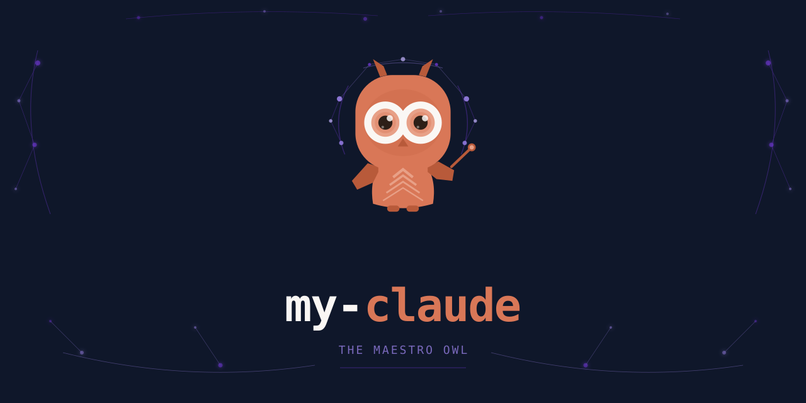

[English](../../README.md) | [한국어](./README.ko.md) | [日本語](./README.ja.md) | [中文](./README.zh.md) | [Deutsch](./README.de.md) | [Français](./README.fr.md)

> [](https://github.com/sehoon787/my-codex) Codex CLI를 찾으시나요? → **my-codex** — 네이티브 TOML 형식으로 제공하는 동일한 오케스트레이션

---

<div align="center">

# my-claude


**Claude Code를 위한 올인원 에이전트 하네스.**
**플러그인 하나로 엄선된 32개 에이전트가 준비됩니다.**

Boss가 런타임에 모든 에이전트, 스킬, MCP 도구를 자동으로 탐색하고,<br>
작업을 적합한 전문가에게 라우팅합니다. 설정 파일도, 보일러플레이트도 없습니다.



</div>

---

## 설치

### 사람을 위한 설치

```bash
git clone --depth 1 https://github.com/sehoon787/my-claude.git /tmp/my-claude
bash /tmp/my-claude/install.sh
rm -rf /tmp/my-claude
```

또는 Claude Code 플러그인으로 먼저 설치한 후 동반 인스톨러를 실행하세요:

```bash
# Claude Code 세션 내에서:
/plugin marketplace add sehoon787/my-claude
/plugin install my-claude@my-claude

# 그런 다음 동반 도구 설치:
git clone --depth 1 https://github.com/sehoon787/my-claude.git /tmp/my-claude
bash /tmp/my-claude/install.sh
rm -rf /tmp/my-claude
```

### AI 에이전트를 위한 설치

```bash
curl -s https://raw.githubusercontent.com/sehoon787/my-claude/main/AI-INSTALL.md
```

전체 출력을 읽은 후, 각 단계를 순서대로 실행하세요. `WebFetch`가 아닌 `curl`을 사용하세요.

---

## Boss의 작동 방식

Boss는 my-claude의 핵심에 있는 메타 오케스트레이터입니다. 코드를 직접 작성하지 않고, 탐색하고 분류하고 매칭하고 위임하고 검증합니다.

```
사용자 요청
     │
     ▼
┌─────────────────────────────────────────────┐
│  Phase 0 · DISCOVERY                        │
│  Scan agents, skills, MCP, hooks at runtime │
│  → Build live capability registry           │
└──────────────────────┬──────────────────────┘
                       ▼
┌─────────────────────────────────────────────┐
│  Phase 1 · INTENT GATE                      │
│  Classify: trivial | build | refactor |     │
│  mid-sized | architecture | research | ...  │
│  → Counter-propose skill if better fit      │
└──────────────────────┬──────────────────────┘
                       ▼
┌─────────────────────────────────────────────┐
│  Phase 2 · CAPABILITY MATCHING              │
│  P0: gstack skill (if installed)            │
│  P1: Exact skill match                      │
│  P2: Specialist agent (32)                  │
│  P3: Multi-agent orchestration              │
│  P4: General-purpose fallback               │
└──────────────────────┬──────────────────────┘
                       ▼
┌─────────────────────────────────────────────┐
│  Phase 3 · DELEGATION                       │
│  6-section structured prompt to specialist  │
│  TASK / OUTCOME / TOOLS / DO / DON'T / CTX  │
└──────────────────────┬──────────────────────┘
                       ▼
┌─────────────────────────────────────────────┐
│  Phase 4 · VERIFICATION                     │
│  Read changed files independently           │
│  Run tests, lint, build                     │
│  Cross-reference with original intent       │
│  → Retry up to 3× on failure               │
└─────────────────────────────────────────────┘
```

### 런타임 행동 교정
- **Delegation Guard** (PreToolUse): 오케스트레이터가 직접 파일 수정 시도 시 서브에이전트 위임을 강제
- **Subagent Verifier** (SubagentStop): 서브에이전트 작업 완료 후 독립 검증을 강제
- **Completion Check** (Stop): 모든 태스크가 완료·검증되었는지 확인 후 세션 종료 허용

### 외부 지식 연동 (MCP)
- **Context7**: 라이브러리 공식 문서를 실시간으로 조회
- **Exa**: 의미 기반 웹 검색 (월 1,000건 무료)
- **grep.app**: GitHub 오픈소스 코드 검색

### 통합 생태계
- 플러그인 하나로 **32 에이전트, 139 스킬, 54 룰**을 한 환경에 구성
- 6개 오픈소스 도구(OMC, omo, ECC, gstack, superpowers, Karpathy)를 하나로 통합. Anthropic 공식 문서 스킬은 `install.sh`가 별도로 추가

---

## Core + OMO 에이전트

**Boss**만 my-claude 고유 에이전트입니다. 나머지 9개는 Boss가 서브 오케스트레이터 및 전문가로 사용하는 [OMO 에이전트](https://github.com/code-yeongyu/oh-my-openagent)입니다. 플러그인은 **32개 에이전트** (Boss 1 + OMO 9 + OMC 19 + 벤더링 3)를 `~/.claude/agents/`에 항상 로드합니다. 온디맨드 에이전트 팩은 더 이상 존재하지 않습니다. Boss는 Priority 2 능력 매칭으로 전체 에이전트 풀에서 최적의 전문가를 선택합니다. 전체 목록은 아래 [구성 요소](#구성-요소)를 참고하세요.

| 에이전트 | 출처 | 모델 | 역할 |
|---------|------|------|------|
| **Boss** | my-claude | Fable | 동적 메타 오케스트레이터. 런타임에 모든 에이전트/스킬/MCP를 자동 감지하고 최적의 전문가에게 라우팅 |
| **Sisyphus** | OMO | Opus | 서브 오케스트레이터. 의도 분류와 검증 프로토콜로 복잡한 멀티스텝 워크플로우 관리 |
| **Hephaestus** | OMO | Opus | 자율 딥 워커. 탐색 → 계획 → 실행 → 검증 사이클을 자율적으로 수행 |
| **Metis** | OMO | Opus | 사전 의도 분석. AI-slop 방지를 위해 요청을 실행 전에 구조화 |
| **Atlas** | OMO | Opus | 마스터 태스크 오케스트레이터. 4단계 QA 사이클로 복잡한 작업을 분해 및 조율 |
| **Oracle** | OMO | Opus | 전략적 기술 자문가. 코드를 변경하지 않고 read-only로 분석하여 방향 제시 |
| **Momus** | OMO | Opus | 작업 계획 검토자. 승인 편향적 관점에서 계획을 검토. read-only |
| **Prometheus** | OMO | Opus | 인터뷰 기반 계획 수립 컨설턴트. 대화를 통해 요구사항을 명확화 |
| **Librarian** | OMO | Sonnet | MCP를 활용한 오픈소스 문서 연구 에이전트 |
| **Multimodal-Looker** | OMO | Sonnet | 시각 분석 에이전트. 이미지/스크린샷을 분석. read-only |

---

## 벤더링 에이전트

`agency-agents` 서브모듈은 2026-07-27에 제거되었습니다. 스택 내에 대체재가 없던 엔지니어링 에이전트 3개(ai-engineer, devops-automator, multi-agent-systems-architect)만 `agents/vendored/`로 스냅샷하여 항상 로드되는 32개에 포함시켰습니다. 각 파일에는 출처·라이선스·스냅샷 날짜가 명시되어 있습니다. 온디맨드 팩과 `--with-packs` 플래그는 더 이상 제공되지 않습니다.

### 우선순위 라우팅

Boss는 가장 적합한 매칭을 찾을 때까지 모든 요청을 우선순위 체인을 통해 순차적으로 처리합니다:

| 우선순위 | 매칭 유형 | 조건 | 예시 |
|:--------:|-----------|------|---------|
| **P0** | gstack 스킬 | 배포·QA·보안 워크플로 | `"ship this"` → gstack `/ship` |
| **P1** | 스킬 매칭 | 작업이 독립적인 스킬에 해당 | `"merge PDFs"` → pdf 스킬 |
| **P2** | 전문가 에이전트 | 도메인별 에이전트 존재 | `"security audit"` → security-reviewer |
| **P3a** | Boss 직접 | 독립적인 에이전트 2~4개 | `"fix 3 bugs"` → 병렬 스폰 |
| **P3b** | 서브 오케스트레이터 | 복잡한 다단계 워크플로 | `"refactor + test"` → Sisyphus |
| **P3c** | 에이전트 팀 | P2P 통신이 필요한 경우 | `"implement + review"` → Review Chain |
| **P4** | 폴백 | 전문가 매칭 없음 | `"explain this"` → 범용 에이전트 |

### 모델 라우팅

| 복잡도 | 모델 | 사용 대상 |
|-----------|-------|----------|
| 최상위 오케스트레이션 | `claude-fable-5-1` | Boss |
| 심층 분석, 아키텍처 | `claude-opus-5` | Sisyphus, Atlas, Hephaestus, Oracle, Metis, Momus, Prometheus |
| 표준 구현 | `claude-sonnet-5` | Librarian, Multimodal-Looker, OMC 전문가 |
| 빠른 조회, 탐색 | `claude-haiku-4-5` | 경량 OMC 에이전트, 간단한 자문 |

### Effort 계층

모델 선택이 *어떤* 두뇌가 작업할지 정한다면, `effort:` 프론트매터 필드는 *얼마나 깊게* 사고할지를 정합니다. 자체 관리 에이전트는 모두 이 값을 선언합니다.

| Effort | 에이전트 |
|--------|--------|
| `xhigh` | Boss, Oracle, Prometheus, Multi-Agent Systems Architect |
| `high` | Sisyphus, Hephaestus, Atlas, Metis, Momus |
| `medium` | Librarian, Multimodal-Looker, AI Engineer, DevOps Automator |

스킬도 effort를 선언합니다 — `boss-briefing`은 `medium`, `briefing-vault`는 `low`입니다. `boss-advanced`와 `gstack-sprint`는 의도적으로 선언하지 않습니다. 스킬의 effort는 실행되는 동안 세션 레벨을 덮어쓰기 때문에, 선언하면 작업 도중 Boss의 effort가 조용히 낮아집니다.

우선순위는 `CLAUDE_CODE_EFFORT_LEVEL`(환경 변수) > 프론트매터 > 세션 effort 레벨 순입니다. `xhigh`는 Fable이 지원하는 상한이며, `max`는 opus 계열 전용이라 그 외 모델에서는 조용히 하위 값으로 대체됩니다.

### 3단계 스프린트 워크플로

엔드투엔드 기능 구현을 위해 Boss는 구조화된 스프린트를 오케스트레이션합니다:

```
Phase 1: DESIGN         Phase 2: EXECUTE        Phase 3: REVIEW
(interactive)            (autonomous)             (interactive)
─────────────────────   ─────────────────────   ─────────────────────
User decides scope      ralph runs execution    Compare vs design doc
Engineering review      Auto code review        Present comparison table
Confirm "design done"   Architect verification  User: approve / improve
```

### 네임드 워크플로

결정적으로 실행되는 멀티에이전트 워크플로입니다. `install.sh`가 `~/.claude/workflows/`로 복사하므로 이 레포뿐 아니라 어느 프로젝트에서든 Workflow 도구로 호출할 수 있습니다.

| 워크플로 | 동작 | 호출 |
|----------|------|------|
| **code-review-fanout** | 4개 관점 리뷰어(정확성, 보안, 성능, 테스트)가 병렬로 펼쳐지고, 보고 전에 모든 발견 사항을 적대적으로 검증합니다 | `Workflow({name: "code-review-fanout"})` — 인자: 리뷰 대상(브랜치, 커밋 범위, 경로). 기본값은 작업 트리 diff |
| **upstream-audit** | 업스트림별 분석가가 핀 델타, 허용목록 적합성, 신규 중복, 보안 시그널, 건전성을 점검한 뒤 종합 액션 목록을 만듭니다 | `Workflow({name: "upstream-audit"})` — 분기별 또는 동기화 전 감사용 |

---

## 아키텍처

```
┌─────────────────────────────────────────────────────┐
│                    User Request                       │
└───────────────────────┬─────────────────────────────┘
                        ▼
┌─────────────────────────────────────────────────────┐
│  Boss · Meta-Orchestrator (Fable)                     │
│  Discovery → Classification → Matching → Delegation  │
└──┬──────────┬──────────┬──────────┬─────────────────┘
   │          │          │          │
   ▼          ▼          ▼          ▼
┌──────┐ ┌────────┐ ┌────────┐ ┌────────┐
│ P3a  │ │  P3b   │ │  P3c   │ │  P1/P2 │
│Direct│ │Sub-orch│ │ Agent  │ │ Skill/ │
│2-4   │ │Sisyphus│ │ Teams  │ │ Agent  │
│agents│ │Atlas   │ │  P2P   │ │ Direct │
└──────┘ │Hephaes│ └────────┘ └────────┘
         └────────┘
┌─────────────────────────────────────────────────────┐
│  Behavioral Layer                                     │
│  Karpathy Guidelines · Rules (54) · Hooks (8)        │
├─────────────────────────────────────────────────────┤
│  Specialist Agents (32)                               │
│  Boss 1 · OMO 9 · OMC 19 · Vendored 3                │
├─────────────────────────────────────────────────────┤
│  Skills (139)                                         │
│  ECC 79 · gstack 27 · OMC 16 · Superpowers 13       │
│  + Core 4                                             │
├─────────────────────────────────────────────────────┤
│  MCP Layer                                            │
│  Context7 · Exa · grep.app                            │
├─────────────────────────────────────────────────────┤
│  Tooling Layer                                        │
│  LSP (2) · Named Workflows (2)                        │
└─────────────────────────────────────────────────────┘
```

---

## 구성 요소

| 카테고리 | 수량 | 출처 |
|----------|------:|--------|
| **에이전트** (항상 로드됨) | 32 | Boss 1 + OMO 9 + OMC 19 + 벤더링 3 |
| **스킬** | 139 | ECC 79 · gstack 27 · OMC 16 · Superpowers 13 · Core 4 |
| **규칙** | 54개 파일 / 9개 룰셋 | ECC 53 (common + 8개 언어 디렉터리) + Core 1 |
| **MCP 서버** | 3 | Context7, Exa, grep.app |
| **훅** | 8개 파일 / 8개 이벤트 | 위임 가드, 텔레메트리, 검증, 지식 금고 |
| **LSP 서버** | 2 | typescript (`typescript-language-server`), python (`pyright-langserver`) |
| **네임드 워크플로** | 2 | code-review-fanout, upstream-audit |
| **업스트림 서브모듈** | 4 | ecc, omc, gstack, superpowers |
| **CLI 도구** | 3 | omc, omo, ast-grep |

위의 에이전트·스킬·룰은 모두 [`scripts/skill-allowlists.sh`](../../scripts/skill-allowlists.sh)의 허용목록에 등재되어 설치 매니페스트로 추적됩니다. Anthropic 공식 문서 스킬(pdf, docx 등)은 `claude plugin add anthropics/skills`로 별도 설치되며 의도적으로 매니페스트에서 제외됩니다.

<details>
<summary><strong>핵심 에이전트 — Boss 메타 오케스트레이터 (1)</strong></summary>

| 에이전트 | 모델 | 역할 | 출처 |
|-------|-------|------|--------|
| Boss | Fable | 동적 런타임 탐색 → 역량 매칭 → 최적 라우팅. 코드를 직접 작성하지 않습니다. | my-claude |

</details>

<details>
<summary><strong>OMO 에이전트 — 서브 오케스트레이터 및 전문가 (9)</strong></summary>

| 에이전트 | 모델 | 역할 | 출처 |
|-------|-------|------|--------|
| Sisyphus | Opus | 의도 분류 → 전문가 위임 → 검증 | [oh-my-openagent](https://github.com/code-yeongyu/oh-my-openagent) |
| Hephaestus | Opus | 자율적 탐색 → 계획 → 실행 → 검증 | oh-my-openagent |
| Atlas | Opus | 작업 분해 + 4단계 QA 검증 | oh-my-openagent |
| Oracle | Opus | 전략적 기술 컨설팅 (읽기 전용) | oh-my-openagent |
| Metis | Opus | 의도 분석, 모호성 탐지 | oh-my-openagent |
| Momus | Opus | 계획 실현 가능성 검토 | oh-my-openagent |
| Prometheus | Opus | 인터뷰 기반 세부 계획 수립 | oh-my-openagent |
| Librarian | Sonnet | MCP를 통한 오픈소스 문서 검색 | oh-my-openagent |
| Multimodal-Looker | Sonnet | 이미지/스크린샷/다이어그램 분석 | oh-my-openagent |

</details>

<details>
<summary><strong>OMC 에이전트 — 전문가 작업자 (19)</strong></summary>

| 에이전트 | 역할 | 출처 |
|-------|------|--------|
| analyst | 계획 전 사전 분석 | [oh-my-claudecode](https://github.com/Yeachan-Heo/oh-my-claudecode) |
| architect | 시스템 설계 및 아키텍처 | oh-my-claudecode |
| code-reviewer | 집중적인 코드 리뷰 | oh-my-claudecode |
| code-simplifier | 코드 단순화 및 정리 | oh-my-claudecode |
| critic | 비판적 분석, 대안 제안 | oh-my-claudecode |
| debugger | 집중적인 디버깅 | oh-my-claudecode |
| designer | UI/UX 디자인 가이드 | oh-my-claudecode |
| document-specialist | 문서 작성 | oh-my-claudecode |
| executor | 작업 실행 | oh-my-claudecode |
| explore | 코드베이스 탐색 | oh-my-claudecode |
| git-master | Git 워크플로 관리 | oh-my-claudecode |
| planner | 신속한 계획 수립 | oh-my-claudecode |
| qa-tester | 품질 보증 테스팅 | oh-my-claudecode |
| scientist | 연구 및 실험 | oh-my-claudecode |
| security-reviewer | 보안 리뷰 | oh-my-claudecode |
| test-engineer | 테스트 작성 및 유지 관리 | oh-my-claudecode |
| tracer | 실행 추적 및 분석 | oh-my-claudecode |
| verifier | 최종 검증 | oh-my-claudecode |
| writer | 콘텐츠 및 문서 작성 | oh-my-claudecode |

</details>

<details>
<summary><strong>벤더링 에이전트 — AI·인프라 전문가 (3)</strong></summary>

`agency-agents` 서브모듈이 제거된 2026-07-27에 [agency-agents](https://github.com/msitarzewski/agency-agents)(MIT)에서 스냅샷했습니다. 스택 내 대체재가 없는 엔지니어링 에이전트만 남겼으며, 각 파일에 출처 표기가 포함되어 있습니다.

| 에이전트 | 역할 | 출처 |
|-------|------|--------|
| AI Engineer | AI/ML 엔지니어링, 모델 통합, 데이터 파이프라인 | agency-agents (벤더링) |
| DevOps Automator | 인프라 자동화, CI/CD, 클라우드 운영 | agency-agents (벤더링) |
| Multi-Agent Systems Architect | 에이전트 토폴로지, 컨텍스트 관리, 장애 복구 | agency-agents (벤더링) |

</details>

<details>
<summary><strong>스킬 — 5개 출처에서 139개</strong></summary>

각 출처는 [`scripts/skill-allowlists.sh`](../../scripts/skill-allowlists.sh)의 허용목록으로 관리되며, 목록에 없는 스킬은 설치되지 않습니다.

| 출처 | 수량 | 주요 스킬 |
|--------|------:|------------|
| [everything-claude-code](https://github.com/affaan-m/everything-claude-code) | 79 | coding-standards, react-patterns, fastapi-patterns, agent-architecture-audit, e2e-testing |
| [gstack](https://github.com/garrytan/gstack) | 27 | /qa, /review, /ship, /cso, /investigate, /office-hours |
| [oh-my-claudecode](https://github.com/Yeachan-Heo/oh-my-claudecode) | 16 | autopilot, ralph, team, ultrawork, ralplan, omc-reference |
| [superpowers](https://github.com/obra/superpowers) | 13 | brainstorming, systematic-debugging, test-driven-development, writing-plans |
| [my-claude Core](https://github.com/sehoon787/my-claude) | 4 | boss-advanced, boss-briefing, briefing-vault, gstack-sprint |

</details>

<details>
<summary><strong>MCP 서버 (3) + 훅 (8)</strong></summary>

**MCP 서버**

| 서버 | 목적 | 비용 |
|--------|---------|------|
|  [Context7](https://mcp.context7.com) | 실시간 라이브러리 문서 | 무료 |
|  [Exa](https://mcp.exa.ai) | 시맨틱 웹 검색 | 월 1천 건 무료 |
|  [grep.app](https://mcp.grep.app) | GitHub 코드 검색 | 무료 |

**동작 훅**

| 훅 | 이벤트 | 동작 |
|------|-------|----------|
| Session Setup | SessionStart | 누락된 도구 자동 감지 + Briefing Vault 컨텍스트 주입 |
| Delegation Guard | PreToolUse | Boss가 파일을 직접 수정하지 못하도록 차단 |
| Agent Telemetry | PostToolUse | 에이전트 사용 기록을 `agent-usage.jsonl`에 저장 |
| Subagent Verifier | SubagentStop | 독립적인 검증 강제 + Briefing Vault에 기록 |
| Completion Check | Stop | 작업 검증 확인 + 세션 요약 프롬프트 |
| Teammate Idle Guide | TeammateIdle | 유휴 팀원에 대해 리더에게 알림 |
| Task Quality Gate | TaskCompleted | 결과물 품질 검증 |

</details>

<details>
<summary><strong>LSP 서버 (2)</strong></summary>

플러그인은 `.lsp.json`에 두 개의 언어 서버를 선언합니다. Claude Code가 필요할 때 자동으로 띄우므로, 에이전트는 빌드를 한 번 돌리지 않고도 즉시 진단과 코드 탐색을 사용할 수 있습니다.

| 서버 | 명령 | 확장자 |
|--------|------|--------|
| typescript | `typescript-language-server --stdio` | `.ts` `.tsx` `.js` `.jsx` `.mjs` `.cjs` |
| python | `pyright-langserver --stdio` | `.py` |

`install.sh`는 두 바이너리를 비치명적으로 설치합니다 — 하나를 설치하지 못해도 해당 서버만 비활성화되고 나머지 설치는 계속됩니다.

</details>

---

##  Briefing Vault

Obsidian 호환 영구 메모리입니다. 모든 프로젝트는 세션에 걸쳐 자동으로 채워지는 `.briefing/` 디렉터리를 유지합니다.

```
.briefing/
├── INDEX.md                          ← 프로젝트 컨텍스트 (최초 자동 생성)
├── sessions/
│   ├── YYYY-MM-DD-<topic>.md        ← AI가 작성한 세션 요약 (강제)
│   └── YYYY-MM-DD-auto.md           ← 자동 생성 스캐폴드 (git diff, 에이전트 통계)
├── decisions/
│   └── YYYY-MM-DD-<decision>.md     ← AI가 작성한 의사결정 기록 (강제)
├── learnings/
│   ├── YYYY-MM-DD-<pattern>.md      ← AI가 작성한 학습 노트
│   └── YYYY-MM-DD-auto-session.md   ← 자동 생성 스캐폴드 (에이전트, 파일)
├── references/
│   └── auto-links.md                ← 웹 검색에서 자동 수집된 URL
├── agents/
│   ├── agent-log.jsonl              ← 서브에이전트 실행 텔레메트리
│   └── YYYY-MM-DD-summary.md        ← 일별 에이전트 사용 요약
├── persona/
│   ├── profile.md                   ← 에이전트 친화도 통계 (자동 업데이트)
│   ├── suggestions.jsonl            ← 라우팅 제안 (자동 생성)
│   ├── rules/                       ← 승인된 라우팅 선호도
│   └── skills/                      ← 승인된 페르소나 스킬
├── archives/                        ← 완료/비활성 노트 (30일+)
│   ├── sessions/
│   ├── decisions/
│   └── learnings/
└── wiki/                            ← 개념 페이지 (자동 제안)
    └── _schema.md
```

### 서브 Vault

| 경로 | 설명 |
|------|------|
| `INDEX.md` | 프로젝트 개요와 최근 의사결정/학습 링크. 첫 세션에 자동 생성, 주기적으로 갱신. |
| `sessions/` | **세션 요약.** `*-auto.md` — git diff 통계와 에이전트 수를 포함한 스캐폴드. `<topic>.md` — 훅에 의해 강제되는 AI 작성 요약. |
| `decisions/` | **아키텍처 및 설계 의사결정** 기록과 근거. AI 작성, 작업 중 강제. |
| `learnings/` | **패턴, 주의사항, 비자명한 해결책.** `*-auto-session.md` — 파일 목록 스캐폴드. `<topic>.md` — AI 작성. |
| `references/` | **웹 조사 URL.** `auto-links.md` — WebSearch/WebFetch 호출 시 자동 수집. |
| `agents/` | **에이전트 텔레메트리.** `agent-log.jsonl` — 호출별 로그. `YYYY-MM-DD-summary.md` — 일별 사용 요약. |
| `persona/` | **사용자 작업 스타일 프로필.** `profile.md` — 도구 친화도 통계. `suggestions.jsonl` — 라우팅 제안. `rules/`, `skills/` — 승인된 선호도. |
| `archives/` | **완료/비활성 노트.** 30일 이상 지난 노트는 아카이브 후보. PARA의 Archives 개념. flat 구조이며 frontmatter의 `type:` 필드로 원본 카테고리를 식별. |
| `wiki/` | **개념 위키 페이지.** 3회 이상 반복 등장한 키워드는 자동 제안. LLM-wiki 개념 적용. `_schema.md`로 형식 정의. |

### 지식 관리 (v2)

BriefingVault v2는 세 가지 지식 관리 방법론을 통합합니다:

| 방법론 | 개념 | BriefingVault 적용 |
|--------|------|-------------------|
| **PARA** (Tiago Forte) | 실행 가능성 기준 분류: Projects, Areas, Resources, Archives | sessions/ = Projects, decisions/ = Areas, references/ = Resources, archives/ = Archives |
| **Zettelkasten** (Luhmann) | 고유 ID와 명시적 링크를 가진 원자적 노트 | learnings/ 파일: `YYYYMMDDHHMMSS` ID, `related:` 링크 2개 이상 필수 |
| **LLM-wiki** (Karpathy) | 소스 노트에서 AI가 관리하는 개념 페이지 | wiki/ 페이지: 3회 이상 반복 키워드에 자동 제안 |

### 세션별 Diff

세션 시작 시 현재 git HEAD를 `.briefing/.session-start-head`에 저장합니다. 세션 종료 시 이 저장된 시점을 기준으로 diff를 계산하여, 이전 세션의 미커밋 변경 사항이 아닌 현재 세션의 변경 사항만 표시합니다.

### Obsidian과 함께 사용하기

1. Obsidian 열기 → **폴더를 보관함으로 열기** → `.briefing/` 선택
2. 노트가 그래프 뷰에 `[[wiki-links]]`로 연결되어 표시됩니다
3. YAML 프론트매터(`date`, `type`, `tags`)로 구조화 검색이 가능합니다
4. 의사결정과 학습의 타임라인이 세션에 걸쳐 자동으로 쌓입니다

---

## 업스트림 오픈소스 출처

my-claude는 MIT 라이선스 업스트림 저장소 4개를 git 서브모듈로 연결하며, 각각 명시적인 SHA에 고정되어 있습니다:

| # | 출처 | 제공 내용 |
|---|--------|-----------------|
| 1 |  **[everything-claude-code](https://github.com/affaan-m/everything-claude-code)** — affaan-m | 설치 스킬 79개 + 룰셋 9개. 언어·스택 지식 레인: TDD, 보안, 코딩 표준, 프레임워크 패턴. |
| 2 |  **[oh-my-claudecode](https://github.com/Yeachan-Heo/oh-my-claudecode)** — Yeachan Heo | 전문가 에이전트 19개 + 설치 스킬 16개. 오케스트레이션 레인: autopilot, ralph, team. |
| 3 |  **[gstack](https://github.com/garrytan/gstack)** — garrytan | 배포·QA·보안 리뷰(Boss P0 레인)를 위한 설치 스킬 27개. Playwright 브라우저 데몬 포함. |
| 4 |  **[superpowers](https://github.com/obra/superpowers)** — Jesse Vincent | 개발 프로세스 레인 설치 스킬 13개: 브레인스토밍, TDD, 체계적 디버깅, 계획 작성. |

서브모듈은 아니지만 스택의 일부인 출처:

| 출처 | 편입 방식 |
|--------|----------------|
|  **[oh-my-openagent](https://github.com/code-yeongyu/oh-my-openagent)** — code-yeongyu | OMO 에이전트 9개(Sisyphus, Atlas, Oracle 등)를 이 저장소의 `agents/omo/`에 독립 `.md` 에이전트로 이식. |
|  **[agency-agents](https://github.com/msitarzewski/agency-agents)** — msitarzewski | 2026-07-27 서브모듈 제거. 엔지니어링 에이전트 3개를 출처 표기와 함께 `agents/vendored/`로 벤더링. |
|  **[anthropic/skills](https://github.com/anthropics/skills)** — Anthropic | `install.sh`가 `claude plugin add anthropics/skills`로 설치(pdf, docx 등). 매니페스트 추적 대상 아님. |
|  **[andrej-karpathy-skills](https://github.com/forrestchang/andrej-karpathy-skills)** — forrestchang | AI 코딩 행동 가이드라인 4가지를 `~/.claude/CLAUDE.md`에 추가. |

---

## GitHub Actions

| 워크플로 | 트리거 | 목적 |
|----------|---------|---------|
| **CI** | push, PR | JSON 설정, 에이전트 프론트매터, 스킬 존재 여부, 업스트림 파일 수 검증 |
| **Smoke** | push, PR | 4개 잡 — `hooks`(훅 실행), `shell`(설치 스크립트 형태), `drift`(모델 드리프트), `routing-refs`(끊어진 에이전트·스킬 참조) |
| **Update Upstream** | 3일마다 / 수동 | `git submodule update --remote` → `SOURCES.json` SHA 핀 갱신 → 업스트림 diff 보안 스캔 → 스캔 통과 시에만 자동 병합, 아니면 사람이 검토하도록 PR을 열어 둠 |
| **Auto Tag** | main에 push | `plugin.json` 버전 읽고 신규 시 git 태그 생성 |
| **Pages** | main에 push | `docs/index.html`을 GitHub Pages에 배포 |
| **CLA** | PR | 기여자 라이선스 동의 확인 |
| **Lint Workflows** | push, PR | GitHub Actions 워크플로 YAML 문법 검증 |

---

## my-claude 오리지널

업스트림 소스를 넘어 이 프로젝트를 위해 특별히 구축된 기능들:

| 기능 | 설명 |
|---------|-------------|
| **Boss 메타 오케스트레이터** | 동적 역량 탐색 → 의도 분류 → 5단계 우선순위 라우팅 → 위임 → 검증 |
| **3단계 스프린트** | 설계 (대화형) → 실행 (ralph를 통한 자율) → 리뷰 (설계 문서와 대화형 비교) |
| **에이전트 티어 우선순위** | core > omo > omc > vendored 중복 제거. 가장 특화된 에이전트가 선택됩니다. |
| **레인 소유권** | 오케스트레이션 → OMC, 개발 프로세스 → superpowers, 배포·QA·보안 → gstack (Boss P0), 언어·스택 지식 → ECC, AI·도메인 → 벤더링 에이전트 |
| **큐레이션 허용목록** | `scripts/skill-allowlists.sh`가 단일 진실 공급원 — 업스트림 수천 개 중 스킬 139개와 룰셋 9개만 살아남아, 목록에 없는 것은 세션 컨텍스트에 절대 올라오지 않습니다 |
| **Briefing Vault** | 세션, 의사결정, 학습, 참조를 포함하는 Obsidian 호환 `.briefing/` 디렉터리 |
| **에이전트 텔레메트리** | PostToolUse 훅이 에이전트 사용량을 `agent-usage.jsonl`에 기록 |
| **무변경 동기화 스킵** | 업스트림 동기화는 서브모듈 범프와 `SOURCES.json` 핀을 스테이징한 뒤, 그 diff가 비어 있지 않을 때만 PR을 생성 |
| **에이전트 중복 탐지** | `tests/validate-sync.sh`가 `agents/`와 omc·superpowers 서브모듈의 에이전트 파일명을 비교해 충돌을 보고 |

---

## 번들된 업스트림 버전

git 서브모듈을 통해 연결됩니다. 고정된 커밋은 `.gitmodules`가 기본으로 추적하며, [`upstream/SOURCES.json`](../../upstream/SOURCES.json)에 AI-BOM으로 미러링됩니다. `install.sh`는 `main`을 따라가지 않고 아래 SHA를 그대로 체크아웃합니다.

| 출처 | SHA | 날짜 | 비교 |
|--------|-----|------|------|
| [everything-claude-code](https://github.com/affaan-m/everything-claude-code) | `4092795` | 2026-07-27 | [compare](https://github.com/affaan-m/everything-claude-code/compare/4092795...HEAD) |
| [oh-my-claudecode](https://github.com/Yeachan-Heo/oh-my-claudecode) | `590fb98` | 2026-07-27 | [compare](https://github.com/Yeachan-Heo/oh-my-claudecode/compare/590fb98...HEAD) |
| [gstack](https://github.com/garrytan/gstack) | `7c9df1c` | 2026-07-27 | [compare](https://github.com/garrytan/gstack/compare/7c9df1c...HEAD) |
| [superpowers](https://github.com/obra/superpowers) | `3dcbd5c` | 2026-07-27 | [compare](https://github.com/obra/superpowers/compare/3dcbd5c...HEAD) |

---

## 기여

이슈와 PR을 환영합니다. 새 에이전트를 추가할 때는 `agents/core/` 또는 `agents/omo/`에 `.md` 파일을 추가하고 `SETUP.md`를 업데이트하세요.

## 크레딧

다음 작업을 기반으로 구축되었습니다: [oh-my-claudecode](https://github.com/Yeachan-Heo/oh-my-claudecode) (Yeachan Heo), [oh-my-openagent](https://github.com/code-yeongyu/oh-my-openagent) (code-yeongyu), [everything-claude-code](https://github.com/affaan-m/everything-claude-code) (affaan-m), [gstack](https://github.com/garrytan/gstack) (garrytan), [superpowers](https://github.com/obra/superpowers) (Jesse Vincent), [agency-agents](https://github.com/msitarzewski/agency-agents) (msitarzewski — 벤더링 에이전트 3개), [anthropic/skills](https://github.com/anthropics/skills) (Anthropic), [andrej-karpathy-skills](https://github.com/forrestchang/andrej-karpathy-skills) (forrestchang).

## 라이선스

MIT 라이선스. 자세한 내용은 [LICENSE](../../LICENSE) 파일을 참조하세요.
